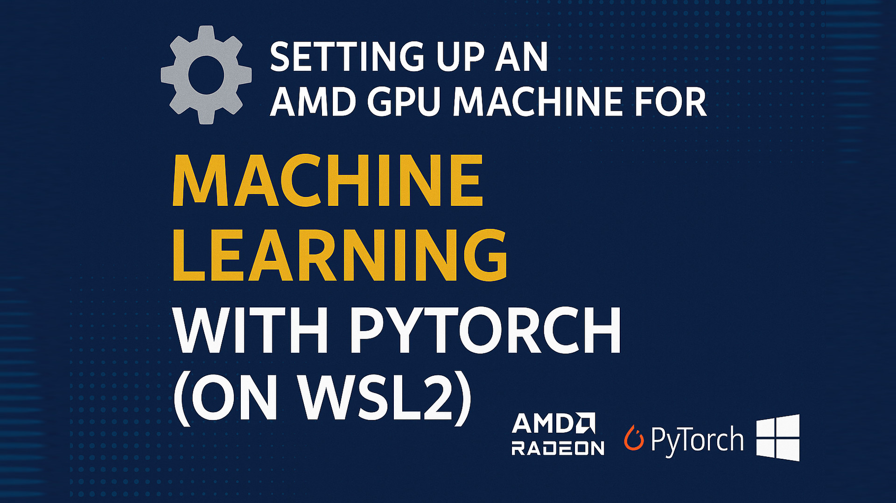

# 🔧 Setting Up an AMD GPU Machine for Machine Learning with PyTorch (on WSL2)

   



NVIDIA is the default choice for many deep‑learning workloads, but AMD is closing the gap with **ROCm** — bringing growing compatibility with popular frameworks like PyTorch.

This guide documents how I set up an **AMD Radeon RX 7900 XT** on **Windows 10 + WSL2** with **Ubuntu 24.04** to run **PyTorch (ROCm build)**.

> **🖥️ Tested setup**
>
> • **GPU:** AMD Radeon RX 7900 XT  
> • **OS:** Windows 10 with WSL2  
> • **WSL Distro:** Ubuntu 24.04  
> • **Use case:** PyTorch (ROCm backend)

---

## ⚙️ 1) Pre‑Requisites (on Windows)

Enable **WSL2** and install **Ubuntu 24.04**:
```bash
wsl --install --web-download Ubuntu-24.04
```
Install **AMD Software: Adrenalin Edition 25.6.1** GPU drivers (on Windows).

---

## 🔧 2) Install ROCm in WSL (Ubuntu)

> Run the following inside your WSL **Ubuntu** terminal.

### a) Install `amdgpu-install` tool
```bash
cd "$HOME" && \
sudo apt update && \
wget -c "https://repo.radeon.com/amdgpu-install/6.4.1/ubuntu/noble/amdgpu-install_6.4.60401-1_all.deb" && \
sudo apt install -y ./amdgpu-install_6.4.60401-1_all.deb
```

### b) Install ROCm stack for WSL
```bash
amdgpu-install -y --usecase=wsl,rocm --no-dkms
```

### c) Confirm GPU is detected
```bash
rocminfo
```
Look for your GPU in the output (e.g., `AMD Radeon RX 7900 XT`).

---

## 🧪 3) Install PyTorch (ROCm build)

### a) Install Python 3.12
```bash
cd "$HOME" && \
sudo apt update && \
sudo apt install -y software-properties-common && \
sudo add-apt-repository -y ppa:deadsnakes/ppa && \
sudo apt update && \
sudo apt install -y python3.12 python3-pip && \
python3 --version
```

> **NumPy:** Current ROCm wheels for PyTorch are incompatible with **NumPy 2.x**. Pin NumPy to **1.26.4** and upgrade pip/wheel:
```bash
pip3 install --upgrade --break-system-packages pip wheel && \
pip3 install --break-system-packages numpy==1.26.4
```

### b) 📥 Download ROCm‑compatible PyTorch wheels
```bash
wget -c \
"https://repo.radeon.com/rocm/manylinux/rocm-rel-6.4.1/torch-2.6.0%2Brocm6.4.1.git1ded221d-cp312-cp312-linux_x86_64.whl" \
"https://repo.radeon.com/rocm/manylinux/rocm-rel-6.4.1/torchvision-0.21.0%2Brocm6.4.1.git4040d51f-cp312-cp312-linux_x86_64.whl" \
"https://repo.radeon.com/rocm/manylinux/rocm-rel-6.4.1/pytorch_triton_rocm-3.2.0%2Brocm6.4.1.git6da9e660-cp312-cp312-linux_x86_64.whl" \
"https://repo.radeon.com/rocm/manylinux/rocm-rel-6.4.1/torchaudio-2.6.0%2Brocm6.4.1.gitd8831425-cp312-cp312-linux_x86_64.whl"
```

### c) 📦 Install PyTorch, TorchVision, Torchaudio & Triton
```bash
pip3 uninstall -y --break-system-packages torch torchvision pytorch-triton-rocm || true
pip3 install --break-system-packages \
torch-2.6.0+rocm6.4.1.git1ded221d-cp312-cp312-linux_x86_64.whl \
torchvision-0.21.0+rocm6.4.1.git4040d51f-cp312-cp312-linux_x86_64.whl \
torchaudio-2.6.0+rocm6.4.1.gitd8831425-cp312-cp312-linux_x86_64.whl \
pytorch_triton_rocm-3.2.0+rocm6.4.1.git6da9e660-cp312-cp312-linux_x86_64.whl
```

### d) 🛠️ Fix runtime lib for WSL
```bash
location="$(pip show torch | awk -F': ' '/Location/ {print $2}')" && \
cd "${location}/torch/lib/" && \
rm -f libhsa-runtime64.so*
```

---

## ✅ 4) Verify the Installation

**Import check**
```bash
python3 -c 'import torch' 2> /dev/null && echo 'Success' || echo 'Failure'
```

**GPU availability**
```bash
python3 -c 'import torch; print(torch.cuda.is_available())'
```

**Device name**
```bash
python3 -c "import torch; print(torch.cuda.get_device_name(0))"
```

**Environment summary**
```bash
python3 -m torch.utils.collect_env
```

---

## 🎯 Summary

- ✅ AMD **ROCm + PyTorch** works on **WSL2**  
- ✅ GPU acceleration verified on **Radeon RX 7900 XT**  
- ✅ A viable path for ML without NVIDIA hardware

---

## 🚀 One‑Command Installer

This repository includes **`install_rocm_pytorch_wsl.sh`**, which automates *all* steps above.

**Run locally (from repo root):**
```bash
bash install_rocm_pytorch_wsl.sh
```

**Or run via raw URL:**
```bash
curl -fsSL https://github.com/nauman73/rocm-pytorch-wsl-setup/main/install_rocm_pytorch_wsl.sh -o install.sh && bash install.sh
```

> The script installs ROCm components for WSL, Python 3.12, pins NumPy to 1.26.4, downloads the ROCm PyTorch wheels, installs them, adjusts the runtime library, and verifies the setup.

---

## 📚 References

- ROCm + WSL: <https://rocm.docs.amd.com/projects/radeon/en/latest/docs/install/wsl/install-radeon.html>  
- PyTorch ROCm build: <https://rocm.docs.amd.com/projects/radeon/en/latest/docs/install/wsl/install-pytorch.html>
